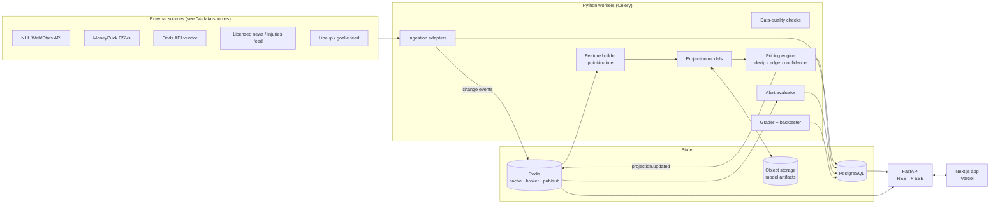

# 01 · System Architecture

RinkX is a research tool for NHL player-prop markets. It answers **"why does the model project this player at this number?"** It does not answer "what should I bet?" Every number on screen has to trace back to a source, a timestamp and a model version.

## 0. Scope: personal use

RinkX is a **single-owner, personal-use** tool. It is not a public or commercial product. That decision drives several simplifications across these docs:

| Area | Personal-use decision |
|---|---|
| Users | One owner account (`role=admin`). No sign-up, user management or multi-tenant concerns. The `users` table stays so alerts and parlays have an owner. |
| Auth | Still required, because the app is internet-reachable and calls paid APIs. Sign-in is restricted to an allowlist containing only the owner's email. |
| Licensing | Free sources used within their personal / non-commercial terms. Nothing is redistributed or shared publicly. If that ever changes, revisit `04-data-sources.md`. |
| Scale | One slate (≤ 16 games/day) and one viewer. No horizontal scaling, CDN tuning or load tests. |
| Cost | Infrastructure targets about $10–25/month plus the odds API subscription. |

The data-integrity rules below **do not** relax for personal use.

## 1. Non-negotiable product rules

These are enforced in code (schema constraints, API contracts and CI tests), not only in copy.

| Rule | Enforcement |
|---|---|
| No fabricated data (lines, injuries, stats, results) | Every external row requires `source_id` + `fetched_at`. Injuries and news also require a `source_ref` URL (`NOT NULL`). |
| Mock data is always labeled | Only `provenance = 'synthetic'` may hold mock rows. The API sets `meta.data_status = "synthetic"` and the UI shows a persistent banner. Production config refuses synthetic rows outright. |
| Missing ≠ zero | Missing inputs go into `player_projections.missing_inputs`. Projections below a data-quality floor are not published and show **"Insufficient data"**. |
| Unavailable markets say so | If no book offers a market, the API returns `null` with `reason: "data_unavailable"` and the UI shows **"Data unavailable"**. |
| No "lock / guaranteed / free money / can't lose" | A copy lint in CI fails the build on banned terms in UI strings and API text fields. |
| Losing periods are never hidden | Model Performance reads from immutable `predictions` + `model_results`. There is no delete path for published predictions. |
| No leakage in evaluation | Each projection stores `as_of`. Features are computed point-in-time, and backtests are walk-forward only. |

## 2. High-level topology



### Components

| Component | Tech | Responsibility |
|---|---|---|
| **Web** | Next.js 15 (App Router) + TypeScript + Tailwind + Recharts + TanStack Query | UI (server components for data-heavy pages). Auth (Auth.js). Talks to the API through a generated typed client. |
| **API** | FastAPI (Python 3.12), Pydantic v2, SQLAlchemy 2 (async) | Read APIs, parlay analysis, alerts CRUD, admin, and an SSE stream for live updates. Stateless and horizontally scalable. |
| **Workers** | Celery 5 + Redis broker, Celery Beat | Ingestion, feature building, projection, pricing, grading, retraining. Separate queues by priority. |
| **Model library** | `rinkx.models` (numpy, scipy, statsmodels, LightGBM, PyMC optional) | Pure Python and importable by both workers and notebooks. No web dependencies. |
| **Database** | PostgreSQL 16 | System of record. Schema in [`db/schema.sql`](../db/schema.sql), migrations via Alembic. |
| **Cache / bus** | Redis 7 | Response cache, Celery broker, Redis Streams for change events, pub/sub for SSE fan-out. |
| **Object storage** | S3-compatible | Serialized models, backtest reports, raw ingestion payloads (kept for audit and replay). |

## 3. Event-driven recalculation (live updates)

Recalculation is driven by **input changes**, not by a clock alone.

```
ingest ──► diff vs. last state ──► emit change event ──► resolve affected projections ──► recompute ──► reprice ──► push
```

| Change event | Example | Affected scope |
|---|---|---|
| `goalie.status_changed` | G2 confirmed instead of G1 | All goalie props for that team. All skater props for the **opponent** (opposing-goalie quality). Game sim for that game. |
| `lineup.role_changed` | Player moves PP2 → PP1 | That player's projections, the player's old and new linemates, and the team's PP-point props. |
| `availability.changed` | Player ruled out | The player is removed. Teammates' TOI is redistributed, then their props are recomputed. |
| `odds.line_changed` | Shots 4.5 → 3.5 | Repricing only (no re-projection). Edge, confidence and alerts update. |
| `odds.game_line_changed` | Game total 6.0 → 6.5 | Game environment, then all props in that game. |
| `game.status_changed` | Postponed / started | Freeze or void projections. Pregame predictions lock at puck drop. |

Each recompute writes a **new** `player_projections` row that `supersedes` the old one, so the UI can show *"Projection updated: 3.6 → 4.1 (moved to PP1)"* with both versions.

**Polling cadence.** Adaptive by time to puck drop, and capped by vendor quotas. Every job logs `quota_remaining`.

| Feed | > 24 h out | 24 h – 3 h | 3 h – lock | Live |
|---|---|---|---|---|
| Starting goalies | 2 h | 30 min | 5 min | — |
| Lineups / PP units | 6 h | 1 h | 10 min | — |
| Injuries / news | 30 min | 15 min | 5 min | 15 min |
| Prop lines | 6 h | 30 min | 5–10 min (quota-dependent) | off |
| Game status / scores | daily | 1 h | 5 min | 1 min |

Clients get updates over **Server-Sent Events** (`GET /api/v1/stream`). SSE is simpler than WebSockets, works through Vercel and CDNs, and handles one-way server-to-client traffic. TanStack Query invalidates the matching queries when an event arrives.

## 4. Request path and caching

* Hot read endpoints (`/games/today`, `/props/best`) are cached in Redis with event-driven invalidation (a projection update for game G purges the keys tagged `game:G`) and a 60 s TTL as a backstop.
* Each response carries a `meta` block: `generated_at`, the oldest `fetched_at` among its inputs, `sources[]` and `data_status ∈ {live, stale, unavailable, synthetic}`. A feed counts as `stale` when its age passes the threshold for its tier above. The UI then shows a stale-data badge and does not hide the value.

## 5. Security and auth

* **Auth.js (NextAuth v5)** with an email magic link (optionally Google), restricted by `ALLOWED_EMAILS` to the owner. The Next.js server mints a short-lived (5 min) signed JWT for API calls, which FastAPI verifies. The owner account has `role=admin`.
* API keys for odds, news and other vendors live only in worker and API environment secrets and never reach the browser.
* Basic IP rate limiting on the auth and API edges to blunt scanning, since the app is public-facing even with a single user.
* Postgres is not exposed to the internet. The API and workers reach it over the private Docker network.
* Admin actions (manual news entry, model promotion) are logged with timestamps, for your own audit trail.

## 6. Responsible-use layer

* A persistent footer says: *"Statistical estimates, not guarantees."* It links to responsible-gambling resources (e.g. 1-800-GAMBLER in the US, ConnexOntario in Ontario).
* An optional session reminder and a "cool-off" mode (`users.rg_settings`) hide pricing and edge views for a chosen period.
* Parlay Builder always shows a variance warning, and the combined probability sits next to the payout.
* No affiliate deep links or "bet now" buttons in v1. The sportsbook column is informational.

## 7. Deployment

Sized for one user. Everything except the web app runs on **one small Linux VM** with Docker Compose.

| Layer | Choice | Notes |
|---|---|---|
| Web | Vercel (Hobby plan, which is for personal non-commercial projects) | Free |
| API + worker + beat | Docker Compose on one VM (e.g. Hetzner, DigitalOcean or Fly.io; 2 vCPU / 4 GB) | Celery runs as **one worker process with priority queues**, not separate fleets |
| Postgres 16 | Container on the same VM, nightly `pg_dump` to object storage | Managed Postgres (Neon / Supabase free tier) is a fine alternative if you'd rather not run backups |
| Redis | Container on the same VM | |
| Object storage | Cloudflare R2 or Backblaze B2 | Raw payloads, model artifacts, DB dumps. Cents per month. |
| TLS / ingress | Caddy (automatic HTTPS) in front of the API | |
| Observability | Structured JSON logs, the in-app admin health page, a free uptime ping, Sentry free tier | No tracing stack |
| CI | GitHub Actions: lint, typecheck, unit tests, schema smoke test against Postgres 16, copy lint, OpenAPI → TS client drift check, nightly backtest regression | Free for this volume |

It can also run entirely on a home machine (`docker compose up`). The only cost is that alerts don't fire while the machine is off.

Environments: `dev` (local, synthetic data allowed) and `prod` (VM, synthetic data forbidden). There is no separate staging environment.
