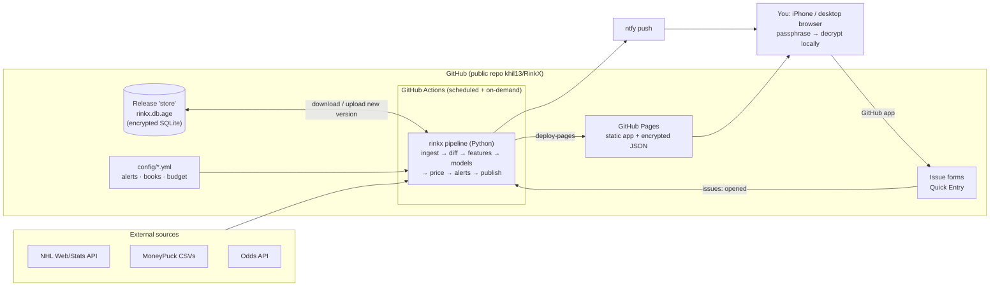

# 01 · System Architecture

RinkX is a research tool for NHL player-prop markets. It answers **"why does the model project this player at this number?"** It does not answer "what should I bet?" Every number on screen has to trace back to a source, a timestamp and a model version.

## 0. Scope and hosting decisions

| Decision | Choice |
|---|---|
| Audience | **Personal use, single owner.** No sign-ups, no user management, nothing commercial. |
| Hosting | **GitHub only.** GitHub Actions does all computing on a schedule. GitHub Pages serves a static site. No servers, no database server. |
| Repo visibility | **Public** (`khil13/RinkX`). Pages is free for public repos and Actions minutes are unlimited on standard runners. |
| Data privacy | Because the site and repo are public, **all data is encrypted**, both at rest and on the published site. Only someone with your passphrase can read it (§5). |
| Cost | $0 for hosting. The only paid item is the odds API subscription. |

GitHub Pages terms allow personal, non-commercial sites. They prohibit using Pages to run a business or SaaS, and prohibit "get-rich-quick schemes". A personal research tool that makes no guarantees fits within that.

## 1. Non-negotiable product rules

These are enforced in code (schema constraints, build checks, CI tests), not only in copy.

| Rule | Enforcement |
|---|---|
| No fabricated data (lines, injuries, stats, results) | Every external row requires `source_id` + `fetched_at`. Injuries and news also require a non-empty source URL (a `CHECK` constraint). |
| Mock data is always labeled | Mock rows must have `provenance = 'synthetic'`. **The publish step aborts the production deploy if any synthetic row exists.** Local dev builds show a fixed SYNTHETIC banner. |
| Missing ≠ zero | Missing inputs go into `player_projections.missing_inputs`. Projections below a data-quality floor are not published and show **"Insufficient data"**. |
| Unavailable markets say so | Absent markets publish as `null` with `reason: "data_unavailable"` and render **"Data unavailable"**. |
| Stale data is visible | Each feed's last successful fetch is in the public `manifest.json`. The UI shows **"Live data unavailable"** or a stale badge when a feed is older than its threshold, or when the whole site hasn't been rebuilt recently. |
| No "lock / guaranteed / free money / can't lose" | A copy lint in CI fails the build on banned terms. |
| Losing periods are never hidden | Published predictions are immutable. SQLite triggers block UPDATE and DELETE on them. |
| No leakage in evaluation | Projections store `as_of`. Features are point-in-time, and backtests are walk-forward only. |

## 2. Topology



### Components

| Component | Tech | Responsibility |
|---|---|---|
| **Pipeline** | Python 3.12 package `rinkx` with a CLI (`python -m rinkx run --stage ...`) | Ingestion, change detection, features, models, pricing, alerts, grading, publishing. Runs only inside GitHub Actions or locally. |
| **Data store** | One **SQLite** file ([`db/schema.sql`](../db/schema.sql)), encrypted with `age`, kept as a GitHub **Release asset** | System of record. Each run downloads the newest version and uploads a new one. The last 10 versions are kept as backups. Release assets live outside git history, so the repo doesn't bloat. |
| **Analytics** | pandas / polars, numpy, scipy, statsmodels, LightGBM; DuckDB for heavy backtest queries (it reads SQLite directly) | Modeling and backtesting on the Actions runner (4 vCPU / 16 GB for public repos). |
| **Site** | Vite + React + TypeScript + Tailwind + Recharts + TanStack Query, `HashRouter` | Static SPA on Pages. Fetches encrypted JSON files and decrypts them in the browser with WebCrypto. No server code. |
| **Quick Entry** | GitHub Issue forms + a workflow on `issues: opened` | The "write" path. You confirm a goalie, scratch, line change or injury from the GitHub iPhone app, with a mandatory source URL. |
| **Alerts** | `config/alerts.yml` → evaluated each run → **ntfy** push | Notifications to your phone. |

## 3. Workflows and update cadence

| Workflow | Trigger | Does |
|---|---|---|
| `pregame.yml` | cron every 10 min, 15:00–03:59 UTC (11 am–midnight ET); `workflow_dispatch` | Exits in under 30 s if no game starts within 8 h. Otherwise: goalies, injuries, odds (budget-aware), game status → recompute affected projections → reprice → alerts → publish if the bundle changed. |
| `hourly.yml` | cron at minute 17 | Schedule, rosters, news, odds on non-game days at a low cadence. |
| `nightly.yml` | cron 09:37 UTC (5:37 am ET) | Final boxscores + PBP, shift-chart lineups, grading and CLV, rolling features, correlations, store backup rotation. |
| `weekly.yml` | Monday 10:13 UTC | Model retraining, walk-forward backtest, calibration report. Champion promotion stays manual (via an issue form). |
| `quick-entry.yml` | `issues: opened` with label `quick-entry` | Validates that the author is the repo owner, writes the row (`provenance='manual'`, `source_ref` = your URL), recomputes affected projections, publishes, then closes the issue with a summary comment. |
| `keepalive.yml` | weekly | Re-enables the scheduled workflows through the API. GitHub silently disables schedules in public repos after 60 days without repository activity, and pipeline runs don't count as activity. |
| `ci.yml` | push / PR | Lint, typecheck, unit tests, schema tests, copy lint, contract tests. |

**Serialization.** Every workflow that touches the store shares `concurrency: { group: rinkx-store, cancel-in-progress: false }`, so two runs never write the store at once. GitHub keeps only the newest pending run in a group. That is fine here, because the next run does a full refresh anyway.

**Timing honesty.** Scheduled runs are commonly delayed by 5–30 minutes under GitHub load, and occasionally skipped. RinkX is therefore a **near-live** tool, not real-time:
* The UI always shows "Updated N min ago" from the manifest.
* Close to puck drop, you can force a refresh with **Run workflow** in the GitHub app (`workflow_dispatch`).
* Quick Entry issues trigger immediately (event-driven, not cron).

### Change-driven recalculation

Inside each run:

```
ingest → diff against store → change events → resolve affected projections → recompute → reprice → alerts → publish
```

| Change | Affected scope |
|---|---|
| Goalie confirmed / changed | That team's goalie props, all opponent skater props, and the game sim |
| Line / PP unit change | The player, old and new linemates, and team PP props |
| Player ruled out | Remove the player, redistribute TOI, recompute teammates |
| Prop line moved | Reprice only |
| Game total / ML moved | Game environment → all props in the game |
| Game started / postponed | Lock or void pregame predictions |

Each recompute inserts a new `player_projections` row that `supersedes` the old one, so the UI shows *"Projection updated: 3.6 → 4.1 (moved to PP1)"*.

### Odds credit budget

`config/budget.yml` sets a monthly credit budget for the odds API. The scheduler spends it where it matters: a light pass in the morning, then the last 3 hours before each game. It covers only the markets and books listed in `config/books.yml`. Each run logs `quota_remaining`, and if the budget runs low, the refresh cadence stretches out. The app still works without odds: projections and hit rates show, and market fields read "Data unavailable".

## 4. Published site and data bundle

Each publish builds the SPA and a **data bundle** of JSON files, then deploys both with `actions/deploy-pages`. Nothing is committed to git.

```
/                       app shell (public, no data)
/data/manifest.json     public: build time, schema version, per-feed last-success times, file hashes
/data/keyfile.json      public: PBKDF2 salt + iterations + the data key wrapped by your passphrase
/data/*.json.enc        everything else, AES-256-GCM encrypted
```

The data contract is in [`03-api.md`](03-api.md). The site polls `manifest.json` every 2 minutes while open and refetches only the files whose hashes changed.

## 5. Security model

The repo, the Release asset and the Pages site are all **publicly downloadable**, so confidentiality comes entirely from encryption.

| Asset | Protection |
|---|---|
| Data store (`rinkx.db.age`) | `age` encryption. The private identity lives only in the Actions secret `STORE_AGE_KEY`. **Keep an offline copy of that key; losing it loses the store.** |
| Published data files | AES-256-GCM with a random 256-bit data key (Actions secret `DATA_KEY`). `keyfile.json` holds that key wrapped with a key derived from your passphrase (PBKDF2-SHA256, 600k iterations). Your passphrase never leaves your device and is never stored in the repo. |
| Unlock on your devices | You enter the passphrase once per device. The browser stores the derived key in IndexedDB as a **non-extractable** CryptoKey. "Lock" clears it. |
| Passphrase strength | All of the protection rests on it. Use a long passphrase (5+ random words). The keyfile is public, so a weak passphrase can be brute-forced offline. |
| API keys | Actions secrets only (`ODDS_API_KEY`, `NTFY_TOPIC`, ...). The ntfy topic is a long random name, which acts as its password.. Never in the bundle or the repo. |
| Quick Entry | The workflow acts only on issues opened by the repo owner, and anyone else's issues are ignored. Issue contents are public, but that information (a goalie confirmation plus a public source URL) is already public. |
| Odds vendor terms | Raw odds are never published in readable form. They exist only inside the encrypted store and bundle, for your personal use. |

What this does **not** hide: the app's code (the repo is public anyway), the fact that the site exists, and the timing and size of updates from `manifest.json`.

## 6. Responsible-use layer

* A persistent footer says: *"Statistical estimates, not guarantees."* It links to responsible-gambling resources (e.g. 1-800-GAMBLER in the US, ConnexOntario in Ontario), and also carries the data attribution (NHL, MoneyPuck).
* An optional cool-off setting (stored on the device) hides pricing and edge views for a chosen period.
* Parlay Builder always shows a variance warning.
* No "bet now" links. The sportsbook columns are informational.

## 7. Environments and local development

| Environment | Where | Data |
|---|---|---|
| `dev` | Your machine: `python -m rinkx run --local` + `npm run dev` | Local SQLite. Synthetic fixtures allowed and bannered. |
| `prod` | GitHub Actions + Pages | Encrypted store. Synthetic rows block the deploy. |

Everything also runs locally with no GitHub dependency, which makes debugging easy and keeps an exit path open if you ever want a server.
