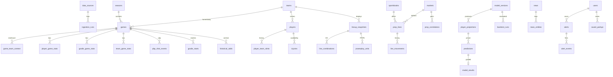

# 02 · Database Design

The authoritative DDL is in [`db/schema.sql`](../db/schema.sql) (PostgreSQL 16). It is checked by [`db/tests/schema_smoke.sql`](../db/tests/schema_smoke.sql). From Phase 1 on, the DDL becomes the first Alembic migration.

## Entity map



## Table groups

| Group | Tables | Notes |
|---|---|---|
| Provenance / ops | `data_sources`, `ingestion_runs`, `data_quality_issues` | Every source is registered with its tier (free/paid/optional) and license notes. Each job run records HTTP calls and the quota left. |
| League | `seasons`, `teams`, `players`, `player_team_stints`, `games`, `game_team_context` | `game_team_context` is derived: rest days, back-to-back flag, games in the last 7 days, travel km (haversine between venues) and time-zone shift. |
| Stats | `player_game_stats`, `goalie_game_stats`, `team_game_stats`, `pbp_shot_events` | TOI is split by strength (EV/PP/SH). Each table has an `extra jsonb` column for new stats without a migration. Shot-level PBP drives shot charts and in-house xG. |
| Availability & roles | `injuries`, `lineup_snapshots`, `line_combinations`, `powerplay_units`, `goalie_starts` | Lineups are stored as **snapshots**, so role changes come from diffing consecutive snapshots. Goalie starts move through `projected → likely → confirmed → actual`. |
| Markets | `markets`, `sportsbooks`, `prop_lines`, `line_movements`, `historical_odds` | `markets` is a catalogue, so a new prop is an `INSERT`. `prop_lines` holds current state. `line_movements` is append-only and partitioned by month. `historical_odds.snapshot_kind='close'` drives closing-line value (CLV). |
| Modeling | `model_versions`, `player_projections`, `predictions`, `model_results`, `backtest_runs`, `prop_correlations` | See below. |
| Users | `users`, `alerts`, `alert_events`, `saved_parlays` | |
| News | `news`, `news_entities` | `url` is `NOT NULL`, so a news item without a source cannot be stored. |

The user's requested core table list maps onto this schema one-to-one. `player_projections` stores full distributions. `predictions` stores those projections priced against a specific line.

## Key design decisions

1. **Props are data, not code.** `markets(code, subject, kind, stat_expr, settlement_rule, model_family)` describes each prop. Supporting a new prop (say "Faceoffs Won") means inserting a row, mapping the vendor's market key to it in the adapter config, and pointing `model_family` at a model. Until a model exists, `model_family` stays `NULL`, and the UI shows lines and hit rates but labels the projection "Not modeled".
2. **Projection ≠ prediction.**
   * `player_projections` holds the model's full PMF for a (player, game, stat), plus inputs, reasons for and against, data quality and `as_of`. It does not depend on any sportsbook.
   * `predictions` freezes that projection against a specific line and price at a moment in time: model probability, raw implied probability, no-vig probability, edge, EV and confidence. These rows are **immutable** and are what backtesting and ROI are computed from.
3. **Immutable projection history.** A recalculation sets `is_current = false` on the old row and inserts a new row with `supersedes` pointing at it. A partial unique index guarantees one current projection per (game, player, market). The chain powers the before/after display.
4. **Point-in-time correctness.** `as_of` on projections, `observed_at`/`reported_at` on lineups, goalies and injuries, and `captured_at` on odds let the feature builder reconstruct "what we knew at time T". Walk-forward backtests depend on this.
5. **Data quality is first-class.** Stat rows carry `provenance` and `quality`. Projections carry `data_quality` and `missing_inputs[]`. A `data_quality_issues` queue feeds the admin dashboard.
6. **Partitioning.** `line_movements` is range-partitioned by month (a scheduled job creates the partitions ahead of time). `pbp_shot_events` and `player_game_stats` grow by about 1M rows a season, which plain B-tree indexes handle fine. They can be partitioned by season later.
7. **One champion per model family.** A partial unique index on `model_versions(model_family) WHERE status='champion'` makes promotion an atomic swap.

## Prop catalogue (seeded)

| Code | Prop | Kind | Model family |
|---|---|---|---|
| `skater_shots_on_goal` | Shots on Goal | O/U | `skater_shots` |
| `skater_goals` | Goals | O/U | `skater_scoring` |
| `skater_assists` | Assists | O/U | `skater_scoring` |
| `skater_points` | Points ("Total Points") | O/U | `skater_scoring` |
| `skater_pp_points` | Power-play Points | O/U | `skater_scoring` |
| `skater_pp_goal` / `skater_pp_assist` | PP Goal / PP Assist | Yes/No | `skater_scoring` |
| `skater_blocked_shots` | Blocked Shots | O/U | `skater_blocks` |
| `skater_hits` | Hits | O/U | `skater_hits` |
| `skater_anytime_goal` | Anytime Goal | Yes/No | `skater_scoring` |
| `skater_first_goal` | First Goal | Yes/No | `game_sim` |
| `goalie_saves` | Saves | O/U | `goalie` |
| `goalie_goals_against` | Goals Against | O/U | `goalie` |
| `goalie_shutout` | Shutout | Yes/No | `goalie` |
| `goalie_win` | Win | Yes/No | `game_sim` |
| `goalie_saves_and_win` | Saves + Win | Yes/No | `game_sim` |
| `game_moneyline`, `game_total`, `team_total` | Game environment inputs | — | `game_sim` |

Settlement rules (whether OT counts, shootout exclusions, void-if-DNP, etc.) live in `markets.settlement_rule`. Books differ here: shootout goals never count as goals, and goalie props generally void if the goalie doesn't start. The adapter records each book's rule, and the grader applies it.

## Running the schema locally

```bash
createdb rinkx
psql -v ON_ERROR_STOP=1 -d rinkx -f db/schema.sql
psql -v ON_ERROR_STOP=1 -d rinkx -f db/tests/schema_smoke.sql   # prints "schema smoke test: OK"
```
